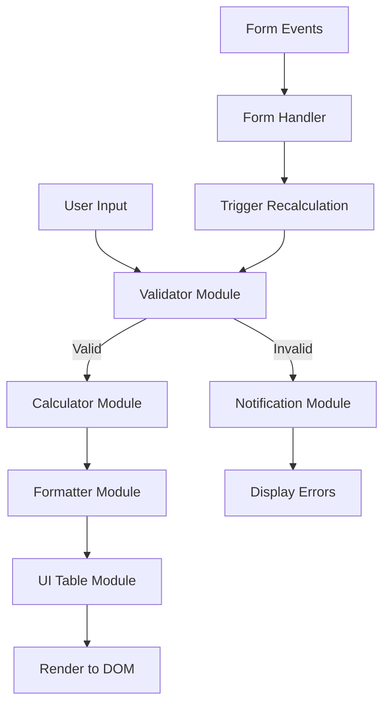

# Technical Specification: Loan Repayment Calculator
**Document ID:** SPEC-001-CoreCalc  
**Version:** 1.0  
**Date:** 2026-09-30  
**Status:** Draft

---

## 1. Overview

This document specifies the technical design for a single-page HTML/JavaScript loan repayment calculator application that computes monthly amortization schedules based on user-provided inputs.

### 1.1 Objectives
- Provide an intuitive, responsive user interface for loan calculation
- Accurately compute fixed monthly payments and full amortization schedules
- Maintain modular, testable, and maintainable code structure
- Support real-time recalculations as users adjust inputs

### 1.2 Scope
- Single-page application (SPA) with no backend dependencies
- Client-side calculations only
- Pure HTML5, CSS3, and modern JavaScript (ES6+)
- Responsive design for desktop and mobile browsers

---

## 2. Mathematical Formulas

### 2.1 Fixed Monthly Payment Calculation

The standard amortization formula for calculating the fixed monthly payment is:

```
M = P × [r(1 + r)^n] / [(1 + r)^n - 1]
```

Where:
- **M** = Fixed monthly payment
- **P** = Principal loan amount
- **r** = Monthly interest rate (annual rate ÷ 12 ÷ 100)
- **n** = Total number of payments (loan period in months)

### 2.2 Amortization Schedule Calculations

For each month `i` (from 1 to n):

**Interest Portion:**
```
Interest_i = Remaining_Balance_(i-1) × r
```

**Principal Portion:**
```
Principal_i = M - Interest_i
```

**Remaining Balance:**
```
Remaining_Balance_i = Remaining_Balance_(i-1) - Principal_i
```

Where:
- `Remaining_Balance_0 = P` (initial principal)
- `Remaining_Balance_n ≈ 0` (should be zero or negligible rounding error)

### 2.3 Edge Cases & Validation

- **Zero or negative principal**: Reject input with validation error
- **Zero or negative interest rate**: Accept 0% interest case with modified formula
- **Zero or negative loan period**: Reject input with validation error
- **Very small balances**: Round final balance to nearest cent
- **Rounding**: All monetary values rounded to 2 decimal places (standard currency precision)

---

## 3. Application Architecture

### 3.1 High-Level Structure

```
loan-calculator/
├── index.html              # Main entry point
├── css/
│   └── styles.css          # Styling and responsive layout
├── js/
│   ├── app.js             # Application bootstrap and orchestration
│   ├── calculator.js      # Core calculation logic
│   ├── formatter.js       # Number and currency formatting utilities
│   ├── validator.js       # Input validation functions
│   └── ui/
│       ├── form.js        # Form handling and event listeners
│       ├── table.js       # Amortization table rendering
│       └── notifications.js # Error/success message display
└── docs/
    ├── requirements/
    │   └── REQ-001-CoreCalc.md
    └── architecture/
        └── SPEC-001-CoreCalc.md
```

### 3.2 Module Responsibilities

#### **app.js** - Application Bootstrap
- Initialize application when DOM is ready
- Coordinate module initialization
- Handle global error boundaries
- Export public API if needed

#### **calculator.js** - Core Business Logic
- `calculateMonthlyPayment(principal, annualRate, months)` → number
- `generateAmortizationSchedule(principal, annualRate, months)` → array
- Helper functions for mathematical operations
- No DOM manipulation; pure functions

#### **formatter.js** - Presentation Utilities
- `formatCurrency(amount)` → string (e.g., "$1,234.56")
- `formatPercentage(value)` → string (e.g., "5.75%")
- `formatNumber(value, decimals)` → string
- Locale-aware formatting where appropriate

#### **validator.js** - Input Validation
- `validateLoanAmount(value)` → {valid: boolean, errors: string[]}
- `validateInterestRate(value)` → {valid: boolean, errors: string[]}
- `validateLoanPeriod(value)` → {valid: boolean, errors: string[]}
- Combined validation function for form submission

#### **ui/form.js** - Form Interaction
- Attach event listeners to input fields
- Real-time validation feedback
- Trigger recalculation on valid input changes
- Handle form reset functionality

#### **ui/table.js** - Amortization Display
- Render amortization schedule as HTML table
- Format table cells using formatter module
- Handle empty/loading/error states
- Optional: export functionality (CSV/PDF)

#### **ui/notifications.js** - User Feedback
- Display validation errors inline
- Show success messages
- Handle loading indicators
- Accessible error announcements (ARIA)

---

## 4. User Interface Design

### 4.1 Layout Components

**Input Section:**
- Three labeled input fields with units:
  - Loan Amount: `$` prefix, numeric input, placeholder "$0.00"
  - Annual Interest Rate: `%` suffix, numeric input, placeholder "0.00%"
  - Loan Period: months (numeric input), dropdown alternative for common terms (12, 24, 36, 60, 120, 240, 360)
- "Calculate" button (primary action)
- "Reset" button (secondary action)

**Results Section:**
- Summary card showing:
  - Fixed Monthly Payment (prominent display)
  - Total Interest Paid
  - Total Amount Payable
- Amortization table below summary:
  - Columns: Month, Payment, Interest, Principal, Remaining Balance
  - Sticky header for long tables
  - Row highlighting for first/last payments
  - Scrollable container for mobile

### 4.2 Responsive Behavior
- Mobile (<768px): Stacked layout, simplified table view (horizontal scroll)
- Tablet (768px-1024px): Two-column grid for inputs/results
- Desktop (>1024px): Full-width layout with centered content

### 4.3 Accessibility
- Semantic HTML5 elements
- ARIA labels for form controls
- Focus management for keyboard navigation
- Screen reader announcements for dynamic content updates
- Color contrast compliance (WCAG AA minimum)

---

## 5. Data Flow



---

## 6. Error Handling Strategy

### 6.1 Client-Side Validation
- Real-time validation on input blur
- Submit-time comprehensive validation
- Clear error messages near affected fields
- Prevent form submission on invalid data

### 6.2 Calculation Errors
- Catch division by zero scenarios
- Handle floating-point precision issues
- Graceful degradation for extreme values
- Log errors to console (development only)

### 6.3 User Experience
- Inline error messages (not alerts)
- Visual indicators (red borders, icons)
- Success confirmation after successful calculation
- Loading state during computation (if async)

---

## 7. Performance Considerations

### 7.1 Optimization Targets
- Initial page load < 2 seconds
- Recalculation < 100ms for typical inputs
- Memory usage minimal (no unnecessary object creation)

### 7.2 Implementation Strategies
- Debounce rapid input changes (200ms delay)
- Memoize expensive calculations where beneficial
- Lazy-load non-critical UI components
- Minify and bundle for production deployment

---

## 8. Testing Requirements

### 8.1 Unit Tests
- Calculator module: verify mathematical accuracy against known examples
- Validator module: test boundary conditions and edge cases
- Formatter module: validate locale-specific formatting

### 8.2 Integration Tests
- End-to-end user flow: input → calculate → verify output
- Responsive behavior across viewport sizes
- Accessibility testing with screen readers

### 8.3 Test Data Examples
```javascript
// Example 1: Standard mortgage
{ principal: 200000, rate: 4.5, months: 360 }
// Expected: Monthly payment ≈ $1,013.37

// Example 2: Zero interest
{ principal: 10000, rate: 0, months: 12 }
// Expected: Monthly payment = $833.33

// Example 3: Short-term loan
{ principal: 5000, rate: 12, months: 24 }
// Expected: Monthly payment ≈ $222.44
```

---

## 9. Future Enhancements (Out of Scope v1.0)

- Multiple currency support
- Extra payment calculator
- Comparison mode (multiple loans side-by-side)
- PDF export of amortization schedule
- Local storage for saving previous calculations
- API integration for live interest rates

---

## 10. Dependencies

### 10.1 External Libraries
- **None** — Pure vanilla JavaScript implementation
- No framework dependencies (React, Vue, Angular)
- No build tools required for development

### 10.2 Browser Support
- Chrome 90+
- Firefox 88+
- Safari 14+
- Edge 90+
- Modern mobile browsers (iOS Safari, Chrome Mobile)

---

## 11. Deployment Considerations

### 11.1 Hosting Options
- GitHub Pages (recommended for simplicity)
- Netlify/Vercel (free tier sufficient)
- Any static web server (Apache, Nginx, IIS)

### 11.2 Build Process
- Optional minification for production
- No transpilation required (ES6+ supported by target browsers)
- Git-based version control with semantic commits

---

## 12. Success Criteria

- ✅ All three requirement outputs implemented correctly
- ✅ Mathematical accuracy verified against external calculators
- ✅ Responsive design works on mobile, tablet, and desktop
- ✅ No JavaScript errors in browser console
- ✅ Accessible to keyboard-only users and screen readers
- ✅ Code is modular, documented, and maintainable
- ✅ Page loads and calculates within performance targets

---

**Document Approval**

| Role | Name | Signature | Date |
|------|------|-----------|------|
| Architect | ___________ | ___________ | _________ |
| Developer | ___________ | ___________ | _________ |
| Stakeholder | ___________ | ___________ | _________ |

---

*End of Document*
